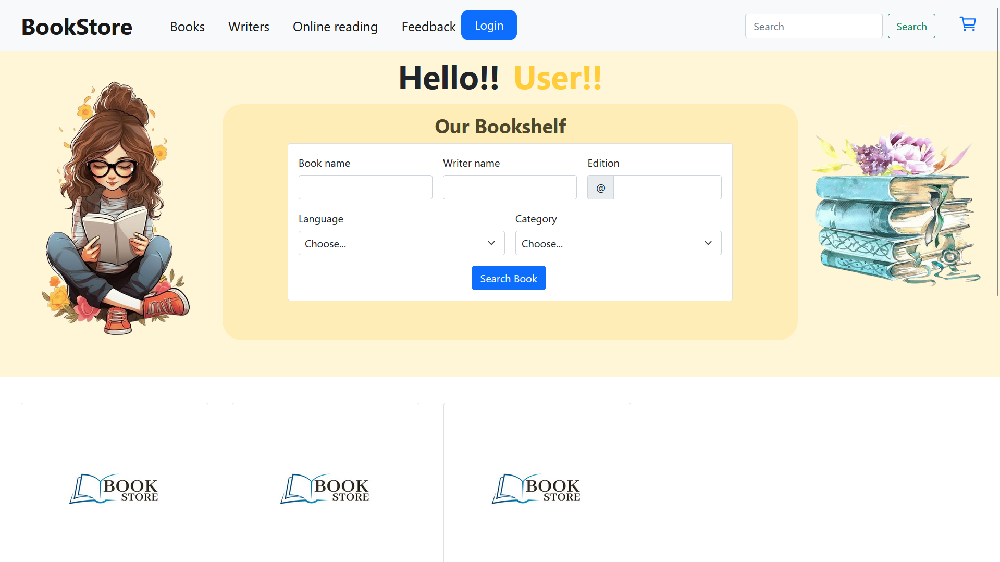

# Online_Book_Store
## Project Overview
The bookstore application will be a simple and **user-friendly** platform to manage books and make purchases. It will have two main roles: **Admin and User**.

### Admin Role
The admin will have a **secure login** to manage the bookstore’s inventory. They can add new books, update details, delete books, organize them into categories, and track stock levels. The admin will enter details like the book's title, author, genre, price, and description, and they can also upload cover images to make the store look attractive.

### User Role
For users, the bookstore will be easy to navigate. Customers can create an account, log in, and explore the available books. They will be able to view detailed information about each book, search for specific titles, and filter options by genres or other preferences. The 'Add to Cart' feature will let users select the books they want to buy and store them in a virtual cart. Before checking out, users can change the quantity of items in the cart or remove any books they no longer want.

## Technologies Used
**Programming Languages:-** Java

**Backend Development:-** JDBC

**Frontend Development:-** JSP, Servlet

**Web Frameworks:-** Bootstrap 5

**Database Management:-** MySQL

**Server:-** Apache Tomcat

# Project Over Look

